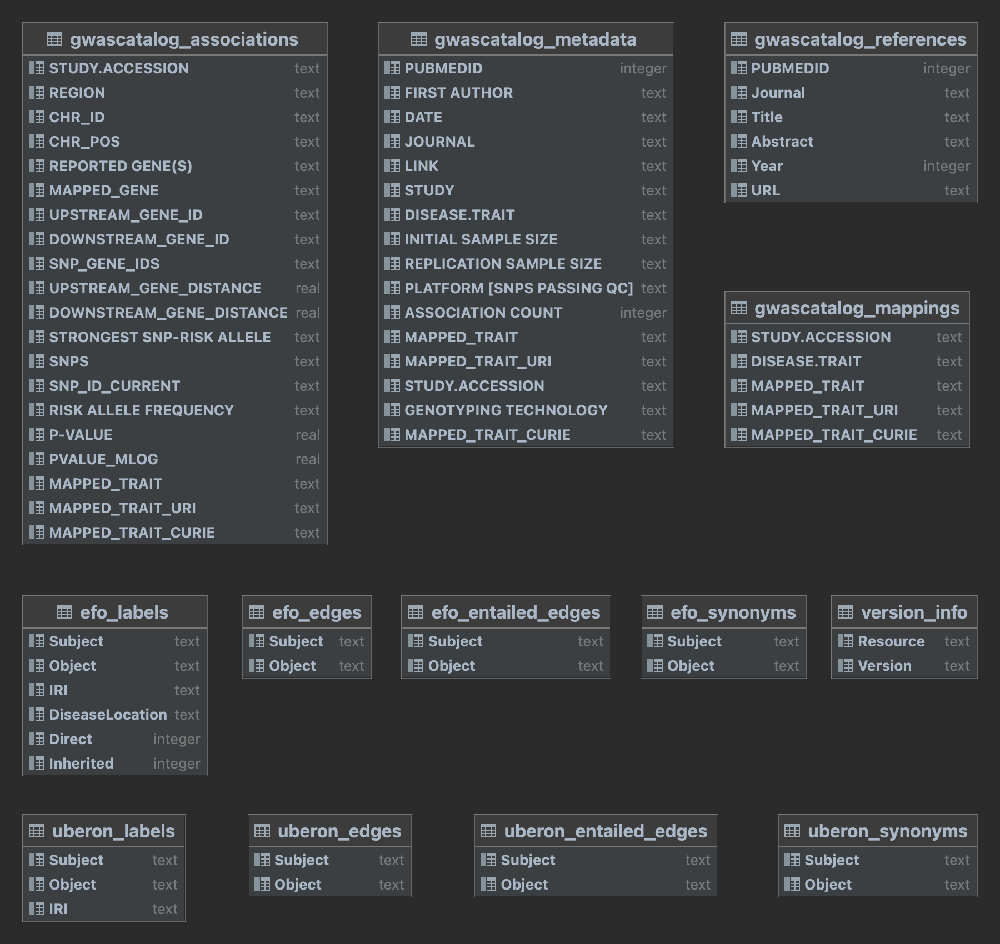

# GWASCatalogSearchDB

This repository provides a SQLite database designed to facilitate search for GWAS records in the [GWAS Catalog](https://www.ebi.ac.uk/gwas/) database—the NHGRI-EBI Catalog of human genome-wide association studies. This is achieved by combining the [EFO](https://www.ebi.ac.uk/efo/) ontology mappings specified in the GWAS Catalog metadata with tabular representations of ontology relationships—extracted from a [SemanticSQL](https://github.com/INCATools/semantic-sql) database representation of EFO—such that users can search for GWAS Catalog records by leveraging the EFO class hierarchy. 

### Latest database build

| Resource       | Version             | 
|----------------|---------------------|
| _SearchDB_     | 0.9.0               |
| _EFO_          | 3.57.0              |
| _UBERON_       | 2023-07-25          |
| _Studies_      | 2023-09-09T17:13:55 |
| _Associations_ | 2023-09-09T17:16:10 |


## Building the database
The database is built by running the Python module below. 

```python
python3 src/build_gwascatalog_db.py
```
This generates a tarball `gwascatalog_search.db.tar.xz` containing the SQLite3 database `gwascatalog_search.db`. 

The database contains the tables depicted and described below.



- `version_info` contains the SearchDB version, ontology versions and download timestamps of the GWAS Catalog tables.
- `gwascatalog_metadata` contains the GWAS Catalog table [_All studies v1.0.2_](https://www.ebi.ac.uk/gwas/docs/file-downloads).
- `gwascatalog_associations` contains some columns from the table [_All associations v1.0.2_](https://www.ebi.ac.uk/gwas/docs/file-downloads).  
- `gwascatalog_references` contains details obtained from PubMed about the articles in the `PUBMEDID` column of the metadata table. 
- `gwascatalog_mappings` contains ontology mappings extracted from `gwascatalog_metadata` with each mapping in a separate row. In the original metadata there are often multiple ontology mappings provided as comma-separated strings.
- `efo_labels` contains the following details:
  - all terms in EFO, represented by their CURIEs (`Subject` column). 
  - term labels (`Object` column). 
  - term IRIs (`IRI` column).
  - disease locations associated with each term, if available (`DiseaseLocation` column). 
  - count of how many metadata points are directly mapped to those ontology terms (`Direct` column). 
  - count of how many metadata points are indirectly mapped to those terms via a more specific term in the hierarchy (`Inherited` column).
- `efo_synonyms` contains the potentially multiple synonyms (in the `Object` column) of each EFO term (given in the `Subject` column).
- `efo_edges` and `efo_entailed_edges` contain, respectively, the asserted and entailed **IS-A**/**SubClassOf** relationships in EFO of the form `Subject IS-A Object`, where `Subject`—the child/subclass term—is represented in the **'Subject'** column. And `Object`—the parent/superclass term—is represented in the **'Object'** column.
  - `efo_edges` allows querying for direct parents of a term, e.g., `SELECT Object FROM efo_edges WHERE Subject='EFO:1000652' ('acute pancreatitis')` returns:

    | Object                          |
    |---------------------------------|
    | EFO:0000278 ('pancreatitis')    |
    | MONDO:0020683 ('acute disease') |

  - `efo_entailed_edges` allows querying for entailed ancestors of a term, e.g., `SELECT Object FROM efo_entailed_edges WHERE Subject='EFO:1000652' ('acute pancreatitis')` returns:

    | Object                                   |
    |------------------------------------------|
    | EFO:0000278 ('pancreatitis')             |
    | MONDO:0020683 ('acute disease')          |
    | EFO:0009605 ('pancreas disease')         |
    | EFO:0001379 ('endocrine system disease') |
    | EFO:0009903 ('inflammatory disease')     |
    | EFO:0000405 ('digestive system disease') |
    | EFO:0000408 ('disease')                  |
    | BFO:0000016 ('disposition')              |
    | BFO:0000020 ('material property')        |
    | EFO:0000001 ('experimental factor')      |

    So `efo_entailed_edges` contains, for a given Subject, all parent terms up to the root of the ontology. The table is called “entailed” because it potentially includes parents derived after reasoning over the ontology, which would not be surfaced by recursively searching over `efo_edges`.


## Querying the database
`src/query_database.py` contains a search function (described below) to query the `gwascatalog_search.db` database for records annotated/mapped to a user-specified set of EFO traits.

```python
# search for GWAS Catalog records annotated with pancreas or infectious disease
connection = sqlite3.connect("gwascatalog.db")
db_cursor = connection.cursor()
resources_annotated_with_terms(db_cursor, 
                               search_terms=['EFO:0009605', 'EFO:0005741'],
                               include_subclasses=True, 
                               direct_subclasses_only=False)
```
The function parameters are:
- `db_cursor`— cursor for database connection
- `search_terms`— a collection of ontology terms to search on
- `include_subclasses`— include resources annotated with subclasses of the given search terms,
        otherwise only resources explicitly annotated with those terms are returned
- `direct_subclasses_only`— include only the direct subclasses of the given search terms,
        otherwise all the resources annotated with inferred subclasses of the given terms are returned
The return value is a pandas dataframe containing all of the resources annotated with the given terms.

Each search term must be an EFO term specified by its compact uniform resource identifier ([CURIE](https://www.w3.org/TR/curie/)). For example `EFO:0005741` is the short form of [http://www.ebi.ac.uk/efo/EFO_0005741](http://www.ebi.ac.uk/efo/EFO_0005741).


### Examples 

Here we exemplify the different possible search options, using `'EFO:0009605' (pancreas disease)` as an example search term.

#### Obtaining resources mapped directly to a search term 
To obtain GWAS Catalog records that are explicitly annotated with a search term, we call the function as such: 

```python
resources_annotated_with_terms(search_terms=['EFO:0009605'],
                               include_subclasses=False, 
                               direct_subclasses_only=False)
```
**_Result = 11 records_**. The underlying query performs a lookup over the `gwascatalog_mappings` table to find records where `MAPPED_TRAIT_CURIE = 'EFO:0009605'`. 


#### Obtaining resources mapped to direct subclasses of a search term
To include resources annotated with EFO terms that are direct subclasses of the search term, we set `include_subclasses=True` to include subclasses and then `direct_subclasses_only=True`.

```python
resources_annotated_with_terms(search_terms=['EFO:0009605'],
                               include_subclasses=True, 
                               direct_subclasses_only=True)
```
_**Result = 21 records**_. The underlying query performs a lookup over the `efo_edges` table to find terms in the `Subject` column (call these `Sub`) that have in the `Object` column the search term `EFO:0009605`. Then the function returns the resources mapped to any `Sub` term.

#### Obtaining resources mapped to any subclass of a search term
To include resources annotated with the search term or any of its inherited/entailed subclasses, we set `direct_subclasses_only=False`, as such:

```python
resources_annotated_with_terms(search_terms=['EFO:0009605'],
                               include_subclasses=True, 
                               direct_subclasses_only=True)
```

**_Result = 408 records_**. The underlying query performs a lookup over the `efo_entailed_edges` table to find `Subject` terms `Sub` where `Object='EFO:0009605'`, and then returns resources mapped to any `Sub` term. Because the entailed_edges table contains all entailed parents (via reasoning) for all ontology terms, this query returns resources annotated with any term that is entailed to be a subclass of the search term.
